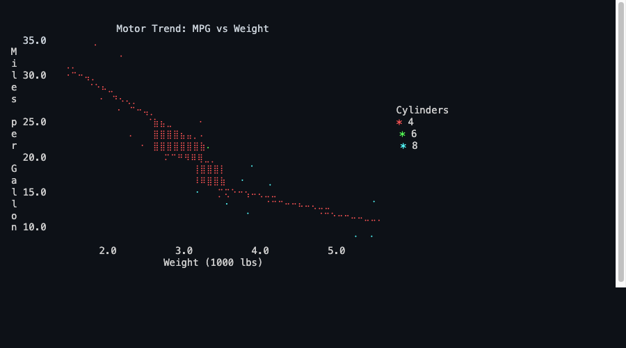
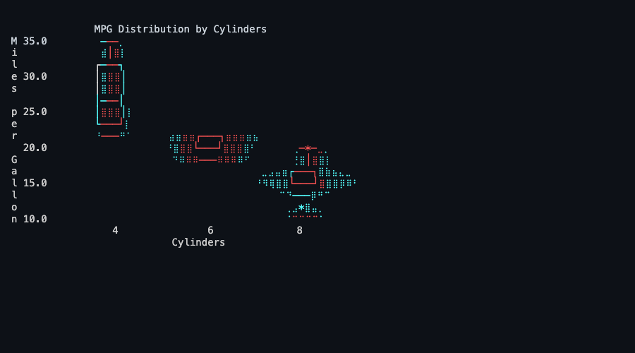

# plotcli: ggplot2 in Your Terminal

[](https://CRAN.R-project.org/package=plotcli)
[](https://cran.r-project.org/web/checks/check_results_plotcli.html)
[](https://www.r-pkg.org/pkg/plotcli)
[](https://www.r-pkg.org/pkg/plotcli)

<p align="center">
  
</p>

plotcli renders ggplot2 plots directly in the terminal using Unicode Braille characters and ANSI colors.
Write your ggplot code as usual, then call `ggplotcli()` to see it in the console -- no graphics device needed.

Inspired by the excellent [UnicodePlots.jl](https://github.com/JuliaPlots/UnicodePlots.jl).

## Installation

```r
# From CRAN
install.packages("plotcli")

# Development version from GitHub
remotes::install_github("cheuerde/plotcli")
```

## Quick Start

Any ggplot2 plot works. Build your plot as usual, then pass it to `ggplotcli()`:

```r
library(plotcli)
library(ggplot2)

p <- ggplot(mtcars, aes(x = wt, y = mpg, color = factor(cyl))) +
  geom_point() +
  geom_smooth(method = "lm", se = FALSE) +
  labs(title = "Motor Trend: MPG vs Weight",
       x = "Weight (1000 lbs)", y = "Miles per Gallon",
       color = "Cylinders")

ggplotcli(p, width = 65, height = 22)
```

<p align="center">
  
</p>

## Gallery

### Scatter Plot

```r
p <- ggplot(iris, aes(Sepal.Length, Sepal.Width, color = Species)) +
  geom_point() +
  labs(title = "Iris: Sepal Dimensions", x = "Sepal Length", y = "Sepal Width")
ggplotcli(p, width = 60, height = 20)
```

<p align="center">
  
</p>

### Line Chart

```r
df <- data.frame(
  x = rep(seq(0, 4 * pi, length.out = 100), 2),
  y = c(sin(seq(0, 4 * pi, length.out = 100)),
        cos(seq(0, 4 * pi, length.out = 100))),
  Function = rep(c("sin(x)", "cos(x)"), each = 100)
)
p <- ggplot(df, aes(x, y, color = Function)) +
  geom_line() +
  labs(title = "Trigonometric Functions", x = "x", y = "y")
ggplotcli(p, width = 60, height = 20)
```

<p align="center">
  
</p>

### Bar Chart

```r
p <- ggplot(mtcars, aes(x = factor(cyl))) +
  geom_bar(fill = "steelblue") +
  labs(title = "Cars by Cylinder Count", x = "Cylinders", y = "Count")
ggplotcli(p, width = 60, height = 20)
```

<p align="center">
  
</p>

### Histogram

```r
p <- ggplot(faithful, aes(x = eruptions)) +
  geom_histogram(bins = 20, fill = "steelblue", color = "white") +
  labs(title = "Old Faithful Eruption Duration", x = "Duration (min)", y = "Count")
ggplotcli(p, width = 60, height = 20)
```

<p align="center">
  
</p>

### Boxplot

```r
p <- ggplot(mtcars, aes(x = factor(cyl), y = mpg)) +
  geom_boxplot(fill = "steelblue") +
  labs(title = "MPG by Cylinder Count", x = "Cylinders", y = "Miles per Gallon")
ggplotcli(p, width = 60, height = 20)
```

<p align="center">
  
</p>

### Violin Plot

```r
p <- ggplot(mtcars, aes(x = factor(cyl), y = mpg)) +
  geom_violin(fill = "steelblue") +
  geom_boxplot(width = 0.15, fill = "white") +
  labs(title = "MPG Distribution by Cylinders", x = "Cylinders", y = "Miles per Gallon")
ggplotcli(p, width = 60, height = 20)
```

<p align="center">
  
</p>

### Density Plot

```r
p <- ggplot(iris, aes(x = Sepal.Length, color = Species)) +
  geom_density() +
  labs(title = "Sepal Length by Species", x = "Sepal Length", y = "Density")
ggplotcli(p, width = 60, height = 20)
```

<p align="center">
  
</p>

### Heatmap

```r
cor_mat <- cor(mtcars[, c("mpg", "cyl", "disp", "hp", "wt", "qsec")])
df <- as.data.frame(as.table(cor_mat))
names(df) <- c("Var1", "Var2", "value")
p <- ggplot(df, aes(Var1, Var2, fill = value)) +
  geom_tile() +
  labs(title = "Correlation Matrix", fill = "r")
ggplotcli(p, width = 55, height = 20)
```

<p align="center">
  
</p>

### Faceted Plot

```r
p <- ggplot(mtcars, aes(x = wt, y = mpg)) +
  geom_point(color = "steelblue") +
  geom_smooth(method = "lm", color = "red", se = FALSE) +
  facet_wrap(~cyl) +
  labs(title = "MPG vs Weight by Cylinders", x = "Weight", y = "MPG") +
  theme_bw()
ggplotcli(p, width = 75, height = 18)
```

<p align="center">
  
</p>

## Supported Geoms (27)

| Geom | Status |
|------|--------|
| `geom_point` | :white_check_mark: |
| `geom_line`, `geom_path` | :white_check_mark: |
| `geom_step` | :white_check_mark: |
| `geom_bar`, `geom_col`, `geom_histogram` | :white_check_mark: |
| `geom_boxplot` | :white_check_mark: |
| `geom_violin` | :white_check_mark: |
| `geom_density` | :white_check_mark: |
| `geom_smooth` | :white_check_mark: |
| `geom_area` | :white_check_mark: |
| `geom_ribbon` | :white_check_mark: |
| `geom_segment`, `geom_hline`, `geom_vline`, `geom_abline` | :white_check_mark: |
| `geom_errorbar`, `geom_linerange`, `geom_pointrange`, `geom_crossbar` | :white_check_mark: |
| `geom_rect`, `geom_tile`, `geom_raster` (heatmaps) | :white_check_mark: |
| `geom_text`, `geom_label` | :white_check_mark: |
| `geom_rug` | :white_check_mark: |
| `facet_wrap`, `facet_grid` | :white_check_mark: |

## Options

```r
# Control size
ggplotcli(p, width = 80, height = 24)

# Canvas types
ggplotcli(p, canvas_type = "braille")  # High resolution (default)
ggplotcli(p, canvas_type = "block")    # Block characters
ggplotcli(p, canvas_type = "ascii")    # ASCII only
```

## Direct R6 Class Usage

For lower-level control, use the `plotcli` R6 class directly:

```r
pc <- plotcli$new(width = 60, height = 20)
pc$add_data(mtcars$wt, mtcars$mpg)
pc$add_title("MPG vs Weight")
pc$print_plot()
```

## Similar Projects

- [txtplot](https://github.com/bbnkmp/txtplot/): The OG in R
- [r-plot](https://github.com/geotheory/r-plot): Collection of excellent terminal plotting functions
- [UnicodePlots.jl](https://github.com/JuliaPlots/UnicodePlots.jl): The gold standard for terminal graphics
- [plotext](https://github.com/piccolomo/plotext): Powerful terminal graphics in Python

## License

`plotcli` is released under the LGPL-3 License.
