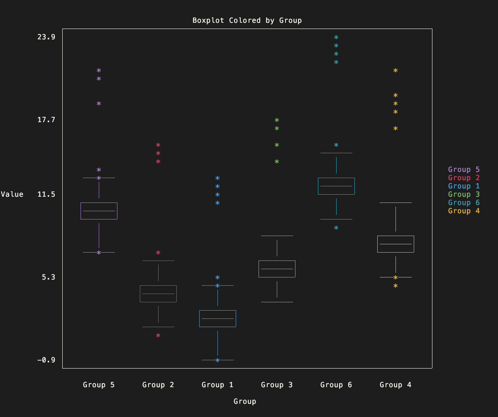
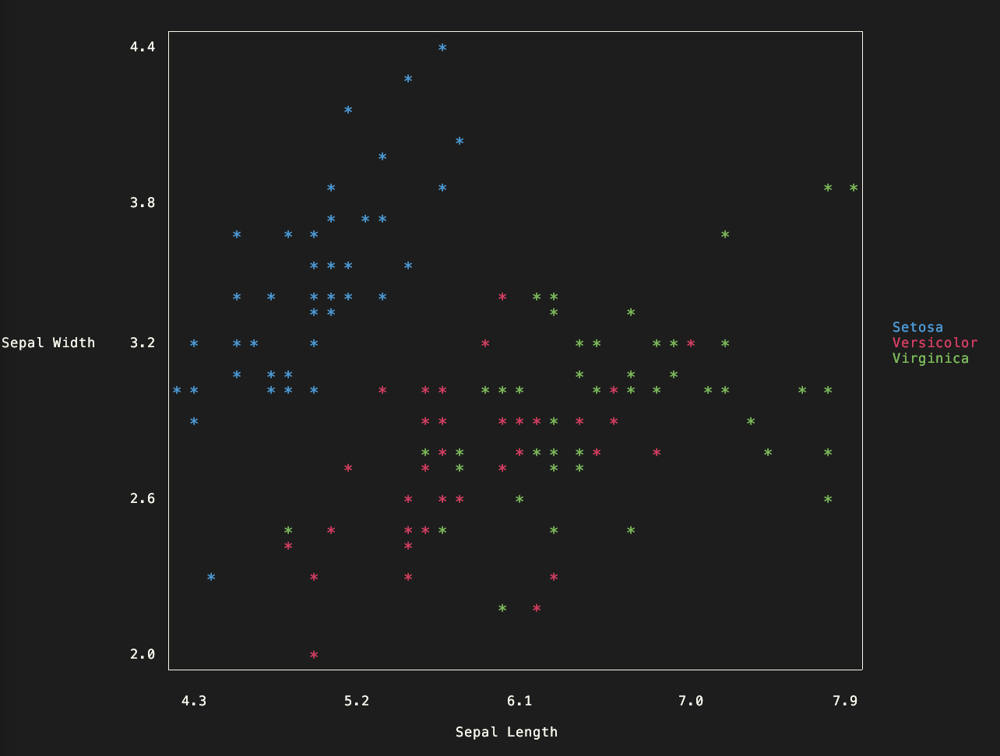
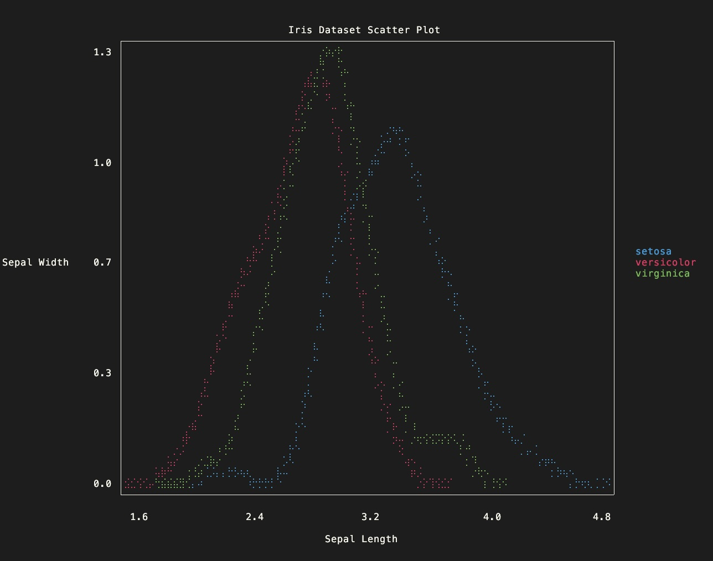
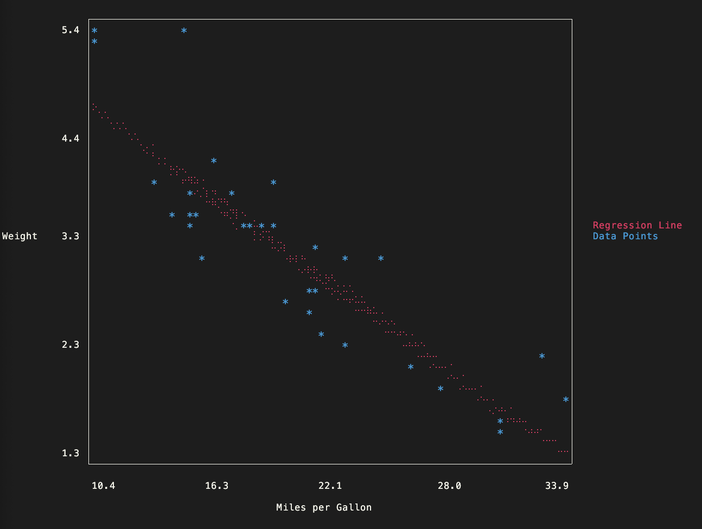
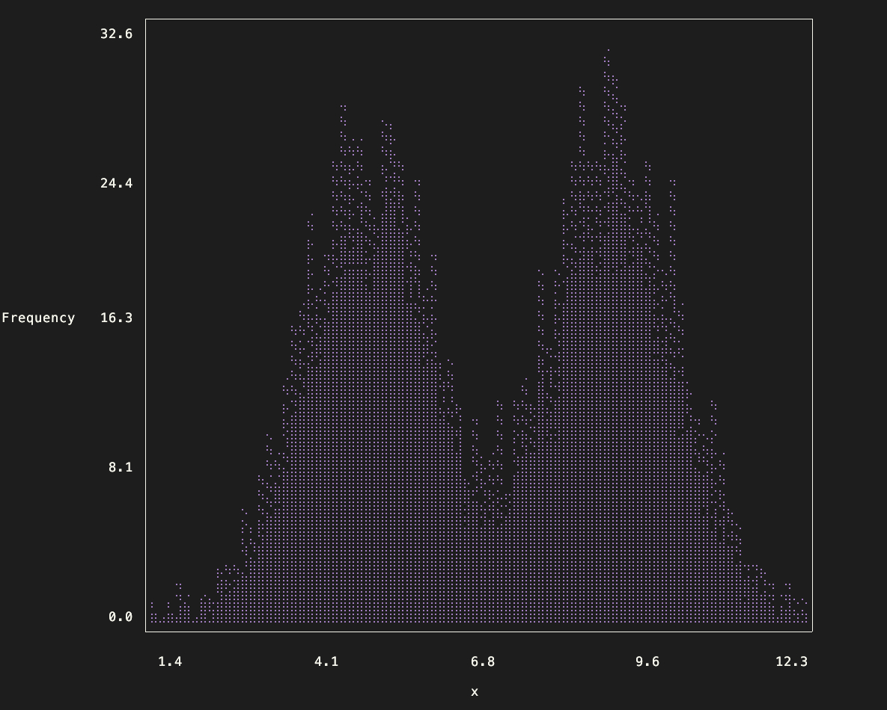
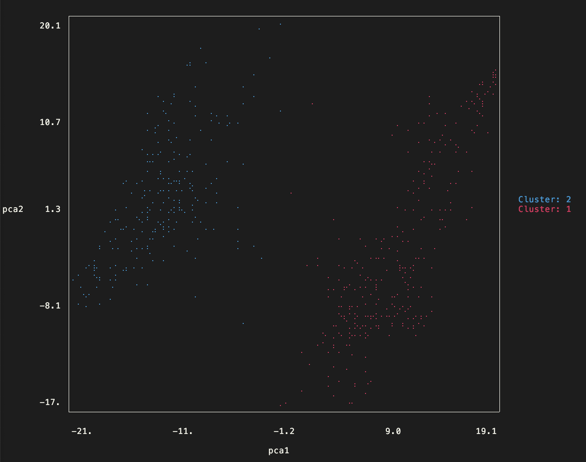

# plotcli: Command-Line Plots for R



plotcli is an R package that brings the power of command-line plotting to your R environment. 
With a simple and intuitive R6 class interface, plotcli allows you to create and customize a 
variety of plot types, such as scatter, line, bar, and box plots, directly in your console. 

Features

- Convert `ggplot2` objects to colored terminal plots with `ggplotcli`
- Easy-to-use R6 class interface
- Supports scatter, line, bar, and box plots
- Customizable plot elements: title, axis labels, ticks, and legend
- Braille character support for high-resolution plots
- Convenience wrappers for most frequently used functions

`plotcli` is heavily inspired by the excellent [UnicodePlots.jl](https://github.com/JuliaPlots/UnicodePlots.jl) library.


```r
> ggplotcli(ggplot(iris, aes(x = Sepal.Width, y = Sepal.Length, color = Species)) + geom_boxplot())

                    ┌────────────────────────────────────────────────────────────┐       
                4.4 │       ───────                                              │       
                    │          │                                                 │       
                    │          │                                                 │       
                    │          │                                                 │       
                    │          │                                   ───────       │       
                3.8 │      ┌───────┐                                  │          │       
                    │      │       │                                  │          │       
                    │      │───────│           ───────                │          │       
                    │      │       │              │                   │          │   setosa   
Sepal.Length    3.2 │      └───────┘              │               ┌───────┐      │   versicolor   
                    │          │                  │               │       │      │   virginica   
                    │          │              ┌───────┐           │───────│      │       
                    │       ───────           │───────│           └───────┘      │       
                    │                         │       │               │          │       
                2.6 │                         │       │               │          │       
                    │                         └───────┘               │          │       
                    │                             │                   │          │       
                    │          *                  │                ───────       │       
                    │                             │                              │       
                2.0 │                          ───────                           │       
                    └────────────────────────────────────────────────────────────┘       
                                                                                         
                            setosa           versicolor           virginica              
                                                                                         
                                             Sepal.Width                                 
```


## Installation

You can install the plotcli package from GitHub using the devtools package:

```r
# Install devtools if you haven't already
if (!requireNamespace("devtools", quietly = TRUE)) {
  install.packages("devtools")
}

# Install plotcli from GitHub
devtools::install_github("cheuerde/plotcli")
```

## Usage

The easiest way to use the package if you are already familiar with `ggplot2`
is to configure your ggplot2 object as usual and then simply convert to a `plotcli`
terminal plot with `ggplotcli`:

```r
# Load the plotcli package
library(plotcli)

data(mtcars)
mtcars$cf = as.character(mtcars$cyl)

p = ggplot(mtcars, aes(x = mpg, y = wt, color = cf)) + geom_point()

# print to terminal
ggplotcli(p, braille = FALSE)
```

Check the vignettes for all possible ways of using the package.

## Showcase







## Similar Projects

 - [txtplot](https://github.com/bbnkmp/txtplot/): The OG in R
 - [r-plot](https://github.com/geotheory/r-plot): Collection of excellent terminal plotting functions
 - [UnicodePlots.jl](https://github.com/JuliaPlots/UnicodePlots.jl): The gold standard for terminal graphics
 - [plotext](https://github.com/piccolomo/plotext): Powerful terminal graphics in python

## License

`plotcli` is released under the MIT License.
